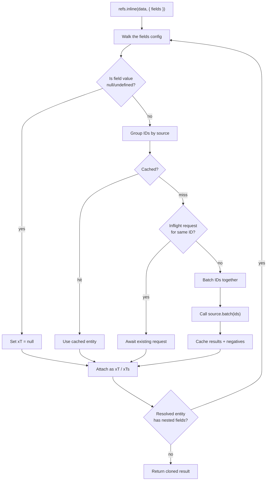

# How Resolution Works

## Resolution pipeline

When you call `refs.inline(data, { fields })`, here's what happens:

Each source collects all needed IDs across the entire tree before fetching. If the same user ID appears as an assignee and a watcher, it's fetched once. IDs not returned by the source are cached as negatives — subsequent resolutions won't re-fetch them until TTL expires.

## Fields config

Resolution is driven by a `fields` object that mirrors the shape of your data:

- **Direct ref**: `{ userId: 'User' }`
- **Direct ref array**: `{ userIds: 'User' }` (where `userIds` is `Array<string | null | undefined>`)
- **Nested ref**: `{ branchId: { source: 'Branch', fields: { facultyId: 'Faculty' } } }`
- **Structural nesting** (into objects/arrays without creating a reference):
  - `{ profile: { avatarFileId: 'File' } }`
  - `{ items: { productId: 'Product' } }` for `items: Array<{ productId: ... }>`

## Output shape (`T` / `Ts`)

For a field `x`:

- If `x` is a single ref ID (`string | null | undefined`), the resolved value is added at **`xT`**.
- If `x` is an array of ref IDs (`Array<string | null | undefined>`), the resolved values are added at **`xTs`**.

The original ID fields stay as-is; the library returns a cloned object (no mutation).

## Null / missing semantics

- If the ID is `null`/`undefined`, the corresponding `xT` / `xTs[i]` is `null`.
- If the ID is present but not returned by the source, it resolves to `null`.

## Depth limit

Resolution is bounded at 10 levels to prevent infinite loops on circular configs.

## Unknown sources

Referencing a source name that doesn't exist at runtime is silently skipped.
